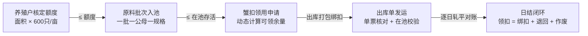

# 阳澄股份大闸蟹全链路溯源品控管理系统 —— 开发者与 AI Agent 核心开发规范手册 (AGENT.md)

> **版本**：V1.4  
> **工程名称**：yangcheng-tracehub  
> **适用对象**：AI 编程助手、全栈开发工程师、品控架构师  

---

## 1. 系统核心定位与业务世界观 (Domain Core)

### 1.1 业务本质
本系统**不是防伪防串货系统**，而是一套**数量闭环管控与供应链合规证明系统**。
- **不追踪单只蟹**：蟹扣为养殖户码（一户一码），不含批次号、无唯一序列号、不扫码。
- **核心业务价值**：通过对 **“额度核定、原料入池、蟹扣领用、出库发运”** 四大数量节点的层层校验与逐日轧平对账，以严密的数字化台账证明：**“公司向市场/渠道发出的带扣蟹总量，严格小于等于签约养殖户的理论产量”**。
- **外部审核支撑**：为山姆会员店（Sam's Club）等大型商超渠道的供应商审核提供批次级反向追溯链条与四本合规台账。

---

## 2. 五大数量守恒定律（系统硬约束，严禁违背）



1. **源头额度卡控**：$\sum \text{Batch.inPoolCount}_{\text{year}} \le \text{Farmer.area} \times 600$。超额直接拦截，确需放行必须 `ADMIN` 特批留痕。
2. **蟹扣领用余量**：$\text{TagClaim.count} \le \min\left(\text{Farmer.activeInPoolTotal}, \text{Farmer.remainingQuota}\right)$。
3. **批次在池存活**：$\text{BookInPool} = \text{inPoolCount} - \text{outPoolCount} - \text{lossCount} \ge 0$。出库数量严禁大于此值。
4. **单票出库核对**：$\text{OutboundCount} = \text{ChannelOrderCount}$（出库数量严格等于渠道订单数量）。
5. **蟹扣日清日结轧平**：$\text{当日领扣数} = \text{当日绑扣出库数} + \text{当日退回数} + \text{当日作废数}$（必须逐日轧平）。

### 核心不等式链：
$$\text{累计出库数} \le \text{累计已核销蟹扣数} \le \text{累计领扣数} \le \text{累计入池数} \le \text{年度核定总额度}$$

---

## 3. 技术栈选型规范 (Tech Stack Blueprint)

| 层次 / 模块 | 技术选型 | 说明 |
| :--- | :--- | :--- |
| **全栈框架** | **Next.js 15 (App Router + React 19)** | Server Actions 强类型调用，RSC 极致首屏体验与 SSR 报表导出 |
| **开发语言** | **TypeScript 5.x (Strict)** | 全链路类型安全，前后端共享 Zod 校验 Schema |
| **数据库 & ORM** | **Prisma ORM 6.x** | 本地开发环境使用 **SQLite (`prisma/dev.db`)**；生产环境支持 **PostgreSQL** |
| **UI 规范** | **shadcn/ui (New York / Nova Style)** | 严格遵循 shadcn/ui 组件规范与最佳实践 |
| **样式体系** | **Tailwind CSS v4** | 严格使用语义化主题 Token（`bg-primary`, `text-muted-foreground` 等） |
| **图标体系** | **lucide-react** | 遵循 shadcn/ui 标准图标组件规范 |
| **表单与校验** | **React Hook Form + Zod** | 实时联动校验（如面积自动算额度、实盘差额算损耗） |
| **数据可视化** | **shadcn/ui Charts / SVG** | 数量闭环看板、额度消耗进度、全链路追溯拓扑流 |
| **消息反馈** | **Sonner (shadcn/ui Toast)** | 操作反馈与品控拦截告警 |
| **自动化测试** | **tsx (Node.js Test Runner)** | 核心数学卡控单元测试与全链路 10 大业务闭环集成测试 |

---

## 4. 严格遵守 shadcn/ui UI 开发规范 (Mandatory UI Rules)

所有前端界面的开发必须**无条件遵守 shadcn/ui 官方规范**，严禁使用非规范的自定义样式或手写拼凑组件：

### 4.1 表单规范 (Forms & Inputs)
- ❌ **严禁**使用裸 `div + space-y-*` 搭配裸 `label` 与非受控 input 手写错误展示。
- ✅ **必须**使用 `Form` + `FormField` + `FormItem` + `FormLabel` + `FormControl` + `FormMessage` 标准表单结构（参考 `src/components/ui/form.tsx`）。
- ✅ 表单校验必须绑定 `zodResolver(schema)`，错误提示由 `FormMessage` 自动响应。
- ✅ 状态标签必须使用 `Badge` 及其对应 variant（`default`, `secondary`, `destructive`, `outline`）。

### 4.2 布局与间距规范 (Layout & Spacing)
- ❌ **严禁**使用已过时的 `space-x-*` 或 `space-y-*`。
- ✅ **必须**使用 `flex flex-col gap-*` 或 `grid gap-*`。
- ✅ 等宽高元素严格使用 `size-*`（如 `size-10`、`size-4`），禁止 `w-10 h-10`。
- ✅ 溢出文本严格使用 `truncate`，禁止手动编写多类名。

### 4.3 颜色与无障碍规范 (Colors & Accessibility)
- ❌ **严禁**手写 `dark:` 颜色覆盖或硬编码 Tailwind 原始色（如 `text-blue-600`、`bg-green-500`）。
- ✅ **必须**使用语义化设计令牌：`bg-background`、`text-foreground`、`bg-primary`、`text-muted-foreground`、`text-destructive`、`border-border`。
- ✅ `Dialog`、`Sheet`、`Drawer` 必须包含 `DialogTitle`、`SheetTitle`、`DrawerTitle`，若视觉隐藏需添加 `className="sr-only"`。
- ✅ `Card` 必须完整使用 `CardHeader`、`CardTitle`、`CardDescription`、`CardContent`、`CardFooter` 组合。

---

## 5. 核心业务规则与状态机 (Business Rules)

### 5.1 暂养池规格复用规则
- 暂养池（`HoldingPool`）作为厂内物理仓位，支持**按规格复用**。
- 池子标记当前在养规格（`currentGender` + `currentWeightTier`）。
- **同规格**（公母一致且重量档位一致）的原料批次可以继续入池；**不同公母或不同规格档位绝对禁止混池**。
- 批次创建时绑定暂养池，暂养期间原则上不换池。当池内所有批次存活清零时，池子自动恢复为空闲待命状态。
- **防删保护**：暂养池只要有在养活蟹（存活 > 0），严禁物理删除。

### 5.2 损耗管理（盘点登记制）
- 损耗不是系统估算，而是现场实盘点数登记产生。
- **公式**：$\text{本次损耗} = \text{账面在池} - \text{实盘数量}$。
- **拦截**：实盘 > 账面在池时，**禁止登记负损耗**，先核查出入库与盘点误差。
- **品控告警**：累计损耗率超过 $5\%$ 时，系统强制要求填写损耗原因，自动标记异常并抄送品控主管。

### 5.3 渠道反向追溯（批次级全链路穿透）
- 渠道人员（如山姆）登录系统后，只可查看发往本渠道门店的数据（行级数据隔离）。
- 追溯链条：`出库单 (CK) -> 原料批次 (PC) -> 暂养池 (ZY) -> 养殖户 (JD) -> 围网 (W) -> 出库日期 -> 门店 (ST)`。
- 系统自动出具符合商超标准的合规追溯单与数量闭环证明。

---

## 6. 项目标准目录结构 (Project Layout)

```
yangcheng-tracehub/
├── docs/                        # 需求分析与系统设计文档
│   ├── PRD_ANALYSIS.md          # 需求剖析与业务逻辑
│   ├── TECHNICAL_SELECTION.md   # 技术选型与架构规范
│   ├── DATA_MODEL.md            # 数据模型与 ER 设计
│   └── BUSINESS_RULES.md        # 5大数量守恒与卡控算法
├── prisma/                      # 数据库建模与迁移
│   ├── dev.db                   # SQLite 本地数据库
│   ├── schema.prisma            # Prisma Schema 核心模型
│   ├── seed.ts                  # 种子数据初始化
│   └── seed-approvals.ts        # 审批测试数据初始化
├── src/
│   ├── app/                     # Next.js 15 App Router
│   │   ├── (auth)/login/        # 登录与角色切换
│   │   ├── layout.tsx           # 全局根布局 (含 ThemeProvider)
│   │   ├── page.tsx             # 数量闭环总看板 (Dashboard)
│   │   ├── farmers/             # 养殖户管理与额度核定
│   │   ├── batches/             # 原料批次 (入池登记、报告上传与盘点损耗)
│   │   ├── pools/               # 暂养池监控与在养规格锁定
│   │   ├── tags/                # 蟹扣领用、核销与日结轧平
│   │   ├── outbound/            # 出库管理、绑扣打包与物流回填
│   │   ├── approvals/           # 品控审批中心 (领扣/出库/异常处理)
│   │   ├── ledgers/             # 四大合规台账 (按日查询与 CSV 导出)
│   │   ├── trace/               # 渠道反向追溯查询 (渠道数据隔离)
│   │   ├── stores/              # 销售门店档案管理 (防误删保护)
│   │   └── users/               # 系统用户与权限管理 (RBAC)
│   ├── components/              # 严格遵守 shadcn/ui 规范的组件
│   │   ├── ui/                  # shadcn/ui 原子组件 (button, form, dialog 等)
│   │   ├── forms/               # 业务表单 Dialog (带 Zod 校验)
│   │   ├── batches/             # 批次详情、冻结、报告查看对话框
│   │   ├── ledgers/             # 台账表格与导出按钮
│   │   ├── trace/               # 追溯全链路时间线与拓扑卡片
│   │   ├── layout/              # AppShell 响应式侧边栏与头部
│   │   └── motion/              # MotionWrapper 动画封装
│   ├── lib/                     # 工具库与业务校验引擎
│   │   ├── prisma.ts            # Prisma 单例
│   │   ├── invariants.ts        # 5大数量守恒纯函数校验引擎
│   │   ├── validations/         # Zod 业务表单校验 Schema
│   │   ├── auth.ts              # 角色守卫 (requireRole / requireAuth)
│   │   ├── session.ts           # Cookie Session 管理
│   │   ├── storage.ts           # 检测报告文件存储
│   │   └── utils.ts             # cn() 等通用工具
│   ├── actions/                 # Server Actions (事务级强一致性业务操作)
│   └── types/                   # TypeScript 类型定义
├── tests/                       # 自动化测试套件
│   ├── invariants.test.ts       # 6 项数学守恒单元测试
│   ├── e2e-workflow.test.ts     # 10 大业务闭环集成测试
│   └── smoke-routes.test.ts     # 页面路由连通性测试
├── AGENT.md                     # 本开发规范手册
├── AGENTS.md                    # AI Agent 行为与 MCP 规则
├── package.json
└── tsconfig.json
```

---

## 7. 开发、维护与验证工作流 (Development & Verification Workflow)

### 7.1 新增业务功能“四步法”
任何业务逻辑开发必须遵循以下分层流程：
1. **Schema 优先**：在 `src/lib/validations/schemas.ts` 中定义 Zod 校验规则与 TypeScript 类型。
2. **纯函数引擎**：涉及数量守恒或数学计算时，在 `src/lib/invariants.ts` 中编写纯函数，并补充 `tests/invariants.test.ts` 单元测试。
3. **事务 Server Action**：在 `src/actions/` 中编写 Server Action，必须使用 `requireRole` 做权限校验，使用 `prisma.$transaction` 保证一致性，并在适当时机记录 `AuditLog`。
4. **shadcn/ui 表单界面**：在 `src/components/forms/` 编写表单 Dialog，使用 `react-hook-form` + `zodResolver`。

### 7.2 严格的编译与验证规则 (Build & Verification Rules)
- ❌ **严禁**运行 `pnpm build` 或 `next build` 来验证代码（会删除 `.next` 目录并导致用户的 `next dev` 开发服务崩溃并报 `ENOENT` 错误）。
- ✅ **必须**使用 `pnpm typecheck` (`tsc --noEmit`) 验证类型正确性。
- ✅ **必须**使用 `pnpm test:unit` 验证核心数学守恒算法。
- ✅ **必须**使用 `pnpm test:e2e` 验证全链路业务闭环。
