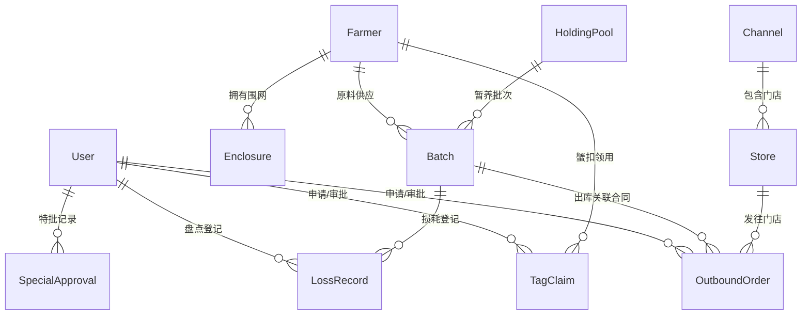

# 阳澄股份大闸蟹全链路溯源品控管理系统 —— 数据模型与 Prisma 架构规范

## 1. 实体关系图 (ERD)



---

## 2. 核心 Prisma Schema 设计

```prisma
datasource db {
  provider = "postgresql"
  url      = env("DATABASE_URL")
}

generator client {
  provider = "prisma-client-js"
}

// -------------------------------------------------------------
// 1. 用户与权限体系 (RBAC)
// -------------------------------------------------------------
enum Role {
  ADMIN            // 超级管理员
  FARMER_ADMIN     // 养殖户管理员
  WAREHOUSE_ADMIN  // 仓库管理员
  QA_DIRECTOR      // 品控主管
  CHANNEL_VIEWER   // 渠道人员
}

model User {
  id              String           @id @default(cuid())
  username        String           @unique
  passwordHash    String
  fullName        String
  role            Role
  channelId       String?          // 渠道人员绑定的所属渠道（用于数据隔离）
  channel         Channel?         @relation(fields: [channelId], references: [id])
  createdAt       DateTime         @default(now())
  updatedAt       DateTime         @updatedAt

  createdBatches  Batch[]          @relation("BatchCreator")
  lossRecords     LossRecord[]     @relation("LossInspector")
  tagClaims       TagClaim[]       @relation("TagApplicant")
  approvedClaims  TagClaim[]       @relation("TagApprover")
  outboundOrders  OutboundOrder[]  @relation("OutboundApplicant")
  approvedOrders  OutboundOrder[]  @relation("OutboundApprover")
  specialApprovals SpecialApproval[]
  auditLogs       AuditLog[]
}

// -------------------------------------------------------------
// 2. 养殖户与围网主档
// -------------------------------------------------------------
enum FarmType {
  LAKE_CRAB // 湖蟹
  POND_CRAB // 塘蟹
}

enum CreditRating {
  A // 连续3年履约无异常
  B // 1-2年履约或轻微违约
  C // 新户或曾有违约
}

enum FarmerStatus {
  ACTIVE    // 正常合作
  SUSPENDED // 暂停合作
  TERMINATED // 终止合作
}

model Farmer {
  id              String        @id @default(cuid())
  code            String        @unique // JD-YYYY-XXX, 如 JD-2026-001
  name            String
  phone           String
  farmType        FarmType
  year            Int           // 自然年度, 如 2026
  area            Decimal       @db.Decimal(10, 2) // 养殖面积 (亩)
  quota           Int           // 核定蟹扣额度 = area * 600
  creditRating    CreditRating  @default(A)
  status          FarmerStatus  @default(ACTIVE)
  createdAt       DateTime      @default(now())
  updatedAt       DateTime      @updatedAt

  enclosures      Enclosure[]
  batches         Batch[]
  tagClaims       TagClaim[]

  @@index([year, status])
}

model Enclosure {
  id          String   @id @default(cuid())
  code        String   // 围网编号, 如 W-01
  farmerId    String
  farmer      Farmer   @relation(fields: [farmerId], references: [id], onDelete: Cascade)
  description String?
  createdAt   DateTime @default(now())
  updatedAt   DateTime @updatedAt

  batches     Batch[]

  @@unique([farmerId, code])
}

// -------------------------------------------------------------
// 3. 暂养池管理 (按规格复用)
// -------------------------------------------------------------
enum CrabGender {
  MALE   // 公蟹
  FEMALE // 母蟹
}

enum PoolStatus {
  ACTIVE
  MAINTENANCE
}

model HoldingPool {
  id                String      @id @default(cuid())
  code              String      @unique // ZY-XX, 如 ZY-01
  name              String      // 暂养池名称, 如 1号公蟹池
  status            PoolStatus  @default(ACTIVE)
  
  // 在养规格锁定 (若无在养批次则为 null, 有在养批次时锁定公母和规格)
  currentGender     CrabGender?
  currentWeightTier String?     // 如 4.0两, 2.5两
  
  createdAt         DateTime    @default(now())
  updatedAt         DateTime    @updatedAt

  batches           Batch[]
}

// -------------------------------------------------------------
// 4. 原料批次管理 (入库即入池, 一批一公母一规格)
// -------------------------------------------------------------
enum BatchStatus {
  TEMPORARY_HOLDING  // 暂养中
  PARTIALLY_OUTBOUND // 部分出库
  COMPLETED          // 已完成 (全部出库+核销)
  FROZEN             // 异常冻结 (品控介入)
}

model Batch {
  id               String          @id @default(cuid())
  code             String          @unique // PC-YYYYMMDD-XXX, 如 PC-20260901-001
  farmerId         String
  farmer           Farmer          @relation(fields: [farmerId], references: [id])
  enclosureId      String
  enclosure        Enclosure       @relation(fields: [enclosureId], references: [id])
  poolId           String
  pool             HoldingPool     @relation(fields: [poolId], references: [id])
  
  gender           CrabGender
  weightTier       String          // 重量档位, 如 4.0两
  inPoolTime       DateTime        @default(now())
  
  // 数量状态跟踪
  inPoolCount      Int             // 入池总数量
  outPoolCount     Int             @default(0) // 已出库数量
  lossCount        Int             @default(0) // 已登记损耗数量
  // 账面在池 = inPoolCount - outPoolCount - lossCount (计算字段)

  status           BatchStatus     @default(TEMPORARY_HOLDING)
  isException      Boolean         @default(false) // 损耗 > 5% 标记
  exceptionReason  String?
  
  createdById      String
  createdBy        User            @relation("BatchCreator", fields: [createdById], references: [id])
  createdAt        DateTime        @default(now())
  updatedAt        DateTime        @updatedAt

  lossRecords      LossRecord[]
  outboundOrders   OutboundOrder[]

  @@index([farmerId, status])
  @@index([poolId, status])
}

// -------------------------------------------------------------
// 5. 损耗盘点登记 (盘点登记制)
// -------------------------------------------------------------
model LossRecord {
  id              String    @id @default(cuid())
  batchId         String
  batch           Batch     @relation(fields: [batchId], references: [id])
  inventoryDate   DateTime  @default(now())
  bookInPool      Int       // 盘点前账面在池数量
  physicalCount   Int       // 实盘在池数量
  lossCount       Int       // 本次损耗 = bookInPool - physicalCount (必须 >= 0)
  cumulativeLoss  Int       // 盘点后累计损耗
  lossRate        Decimal   @db.Decimal(5, 2) // 累计损耗率 (%) = (cumulativeLoss / inPoolCount) * 100
  reason          String    // 损耗原因 (损耗率 > 5% 时必填)
  
  inspectorId     String
  inspector       User      @relation("LossInspector", fields: [inspectorId], references: [id])
  createdAt       DateTime  @default(now())

  @@index([batchId, inventoryDate])
}

// -------------------------------------------------------------
// 6. 蟹扣领用与日清日结
// -------------------------------------------------------------
enum ApprovalStatus {
  PENDING
  APPROVED
  REJECTED
}

model TagClaim {
  id              String          @id @default(cuid())
  claimDate       DateTime        @db.Date // 领用日期
  farmerId        String
  farmer          Farmer          @relation(fields: [farmerId], references: [id])
  
  claimCount      Int             // 本次申请领扣数量
  boundCount      Int             @default(0) // 当日已绑扣出库数量
  returnedCount   Int             @default(0) // 当日退回数量
  returnReason    String?
  scrappedCount   Int             @default(0) // 当日作废数量
  scrapReason     String?
  
  isBalanced      Boolean         @default(false) // 轧平状态: claimCount == boundCount + returnedCount + scrappedCount
  status          ApprovalStatus  @default(PENDING)
  
  applicantId     String
  applicant       User            @relation("TagApplicant", fields: [applicantId], references: [id])
  approverId      String?
  approver        User?           @relation("TagApprover", fields: [approverId], references: [id])
  approvalComment String?
  approvedAt      DateTime?

  createdAt       DateTime        @default(now())
  updatedAt       DateTime        @updatedAt

  @@index([claimDate, farmerId])
}

// -------------------------------------------------------------
// 7. 渠道与门店主档
// -------------------------------------------------------------
model Channel {
  id              String          @id @default(cuid())
  code            String          @unique // 如 SAMS, HEMA
  name            String          // 如 山姆会员店
  createdAt       DateTime        @default(now())
  updatedAt       DateTime        @updatedAt

  stores          Store[]
  users           User[]
  outboundOrders  OutboundOrder[]
}

model Store {
  id              String          @id @default(cuid())
  code            String          @unique // ST-XX, 如 ST-01
  name            String          // 门店全称, 如 山姆会员店(苏州邻瑞店)
  channelId       String
  channel         Channel         @relation(fields: [channelId], references: [id])
  isActive        Boolean         @default(true)
  createdAt       DateTime        @default(now())
  updatedAt       DateTime        @updatedAt

  outboundOrders  OutboundOrder[]
}

// -------------------------------------------------------------
// 8. 出库管理 (打包绑扣与物流回填)
// -------------------------------------------------------------
model OutboundOrder {
  id                String          @id @default(cuid())
  code              String          @unique // CK-YYYYMMDD-XXX, 如 CK-20260901-001
  batchId           String
  batch             Batch           @relation(fields: [batchId], references: [id])
  storeId           String
  store             Store           @relation(fields: [storeId], references: [id])
  channelId         String
  channel           Channel         @relation(fields: [channelId], references: [id])
  
  outboundCount     Int             // 出库数量
  channelOrderCount Int             // 渠道订单数量 (必须 == outboundCount)
  
  logisticsNo       String?         // 物流单号 (支持后回填, 初始可填"待生成")
  logisticsUpdatedAt DateTime?
  logisticsUpdatedBy String?
  
  status            ApprovalStatus  @default(PENDING)
  rejectReason      String?
  
  applicantId       String
  applicant         User            @relation("OutboundApplicant", fields: [applicantId], references: [id])
  approverId        String?
  approver          User?           @relation("OutboundApprover", fields: [approverId], references: [id])
  approvalComment   String?
  approvedAt        DateTime?

  createdAt         DateTime        @default(now())
  updatedAt         DateTime        @updatedAt

  @@index([batchId, status])
  @@index([channelId, createdAt])
}

// -------------------------------------------------------------
// 9. 特批留痕与系统审计日志
// -------------------------------------------------------------
model SpecialApproval {
  id          String   @id @default(cuid())
  actionType  String   // 如 OVER_QUOTA_INTAKE (超额入池特批)
  farmerId    String
  batchCode   String?
  reason      String   // 特批原因 (必填)
  approvedById String
  approvedBy  User     @relation(fields: [approvedById], references: [id])
  createdAt   DateTime @default(now())
}

model AuditLog {
  id          String   @id @default(cuid())
  operatorId  String
  operator    User     @relation(fields: [operatorId], references: [id])
  action      String   // 操作类型 (如 INTAKE, TAG_CLAIM, LOSS_REGISTER, OUTBOUND)
  entityType  String
  entityId    String
  details     Json?    // 变更明细与关键上下文
  ipAddress   String?
  createdAt   DateTime @default(now())

  @@index([entityType, entityId])
  @@index([operatorId, createdAt])
}
```
