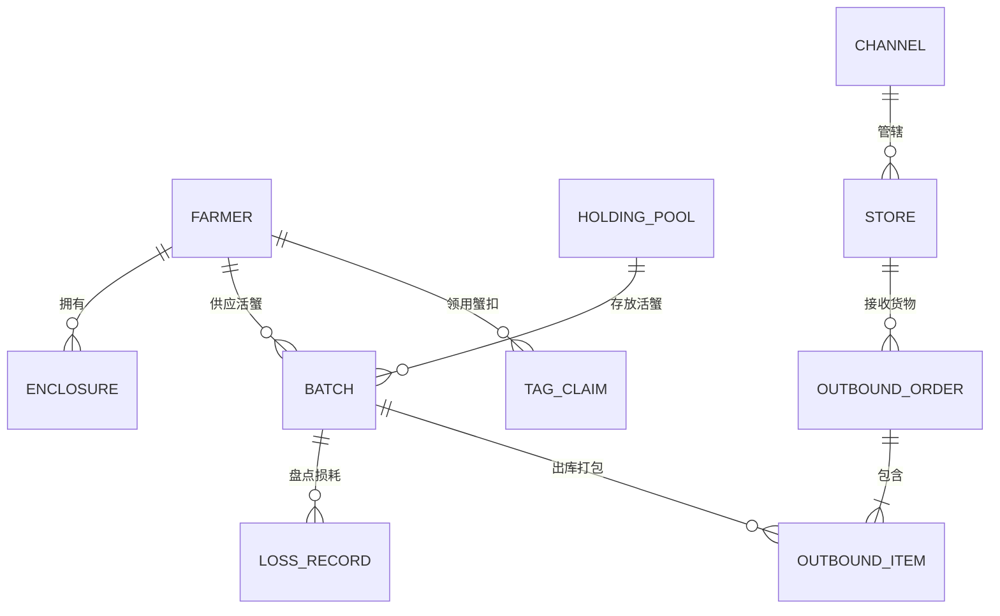
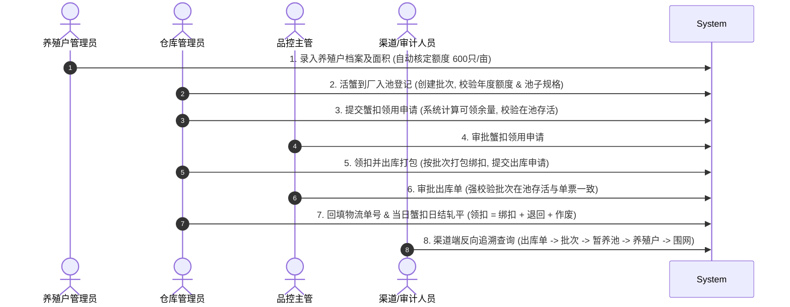

# 阳澄股份大闸蟹全链路溯源品控管理系统 —— 需求深度剖析与业务规范

## 1. 业务本质与核心定位

### 1.1 系统的核心本质
本系统**不是防伪溯源系统**，而是一套**数量闭环管控与合规证明系统**。
- **不追踪单只蟹**：蟹扣无唯一序列号（一户一码），不扫码、不追踪单扣轨迹。
- **核心业务价值**：通过对 **“额度核定、活蟹入池、蟹扣领用、出库发运”** 四个关键数量节点的严密校验、事务级约束与逐日轧平对账，以不可篡改的数字化台账证明：**“公司向市场/渠道发出的带扣阳澄湖大闸蟹总量，严格小于等于签约养殖户的理论核定产量”**。
- **对外部审查支撑**：为山姆会员店（Sam's Club）等大型零售渠道的供应商溯源与品控审核提供严密、完整的批次级反向追溯链条与四本合规台账。

---

## 2. 核心业务实体与概念模型

### 实体定义与业务属性
1. **养殖户 (Farmer)**：
   - 额度核定主体与源头控制单元。
   - 编号规范：`JD-YYYY-XXX`（如 `JD-2026-001`）。
   - 核心规则：蟹扣额度 = 养殖面积（亩） × 600只/亩（按自然年核定）。
   - 信用评级：A级（≥3年无违约）、B级（1-2年或轻微异常）、C级（新户或曾有违约）。
2. **围网 (Enclosure Net)**：
   - 养殖户名下的具体养殖水域编号，建立水源地台账。
3. **暂养池 (Holding Pool)**：
   - 活蟹在厂内的物理存放仓位。
   - 编号规范：`ZY-XX`（如 `ZY-01`）。
   - **规格标记与复用规则**：池子标记当前“在养规格”（公/母 + 重量档位）。同规格活蟹可复用入池；不同公母或不同重量规格**绝对禁止混池**；批次入池后暂养期间不换池。
4. **原料批次 (Batch)**：
   - 内部流转与追溯的管理核心。“**入库即入池，一批一公母一规格**”。
   - 编号规范：`PC-YYYYMMDD-XXX`（如 `PC-20260901-001`）。
   - 状态流转：`TEMPORARY_HOLDING` (暂养中) -> `PARTIALLY_OUTBOUND` (部分出库) -> `COMPLETED` (已完成) / `FROZEN` (异常冻结)。
5. **蟹扣 (Crab Tag)**：
   - 养殖户身份标识物，扣面印养殖户编码（JD号），仅标记来源养殖户。按数量进行日清日结管控。
6. **出库单 (Outbound Order)**：
   - 货物流向记录。绑扣在出库打包时进行，边绑边核。
   - 编号规范：`CK-YYYYMMDD-XXX`（如 `CK-20260901-001`）。
   - 状态流转：`PENDING_REVIEW` (待审核) -> `APPROVED` (已出库) / `REJECTED` (已驳回)。
7. **渠道与门店 (Channel & Store)**：
   - 销售终端档案。门店隶属渠道（如山姆），出库必须从档案中下拉选择，有历史出库记录的门店禁止删除。

---

## 3. 五大数量守恒定律与数学卡控模型

系统全流程构建在严密的数学约束之上，任何破坏守恒的操作都会被系统实时拦截：

$$\begin{aligned}
\text{1. 年度源头上限:} &\quad \sum \text{Batch.inPoolCount}_{\text{year}} \le \text{Farmer.annualQuota} \\
\text{2. 蟹扣领用余量:} &\quad \text{TagClaim.count} \le \min\left(\text{Farmer.activeInPoolTotal}, \text{Farmer.remainingQuota}\right) \\
\text{3. 批次账面存活:} &\quad \text{BookInPool} = \text{inPoolCount} - \text{outPoolCount} - \text{registeredLoss} \\
\text{4. 单票出库校验:} &\quad \text{Outbound.count} \le \text{Batch.BookInPool} \quad \land \quad \text{Outbound.count} = \text{Order.count} \\
\text{5. 当日领扣轧平:} &\quad \text{DailyClaimCount} = \text{DailyBoundCount} + \text{DailyReturnCount} + \text{DailyScrapCount}
\end{aligned}$$

### 综合不等式链：
$$\text{累计出库数} \le \text{累计已核销蟹扣数} \le \text{累计领扣数} \le \text{累计入池数} \le \text{年度核定总额度}$$

---

## 4. 核心业务流程与时序图

### 4.1 核心全链路流程

### 4.2 损耗管理（盘点登记制）
- **盘点逻辑**：损耗由实地盘点产生，而非系统估算。
- **公式**：$\text{本次损耗} = \text{账面在池} - \text{实盘数量}$。
- **异常拦截**：若 实盘数量 > 账面在池，系统严禁登记负损耗，提示先排查出入库与盘点误差。
- **品控告警**：当 $\text{批次累计损耗率} = \frac{\text{累计损耗}}{\text{入池总数}} > 5\%$ 时，触发系统高亮异常，损耗原因必填，并自动抄送品控主管。

---

## 5. 权限矩阵 (RBAC)

| 角色 | 核心职能 | 可操作模块 |
| :--- | :--- | :--- |
| **超级管理员 (ADMIN)** | 系统运维、全局配置、特批越权放行（必须留痕） | 全部模块、特批日志、操作审计 |
| **养殖户管理员 (FARMER_ADMIN)** | 供应商准入与档案维护 | 养殖户建档、围网维护、额度重算 |
| **仓库管理员 (WAREHOUSE_ADMIN)** | 现场实物操作与台账登记 | 批次入池登记、盘点损耗、蟹扣申请、出库申请、物流回填、池子配置、门店维护 |
| **品控主管 (QA_DIRECTOR)** | 合规卡控、风控审批与异常介入 | 蟹扣领用审批、出库审批、损耗异常调查、批次冻结/解冻 |
| **渠道人员 (CHANNEL_VIEWER)** | 采购端全链路追溯与验真 | 仅限本渠道出库单反向全链路追溯、合规证明查看（严格数据隔离） |

---

## 6. 四大合规台账与追溯矩阵

1. **台账一 · 养殖户与围网台账**：全量静态主档，展示编号、养殖面积、核定额度、当年累计入池、剩余额度、信用等级。
2. **台账二 · 蟹扣领用台账**：支持按日筛选，展示养殖户、当日领用、绑扣出库、退回、作废及轧平状态（已轧平 / 未轧平告警）。
3. **台账三 · 暂养池出入库台账**：按日记录各池批次流动，展示池号、在养规格、入池数、出池数、损耗数及实时在池存活。
4. **台账四 · 出库与订单台账**：按日记录发货单、对应批次、门店全称、所属渠道、订单数、出库数、物流单号与审批状态。
